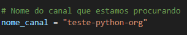
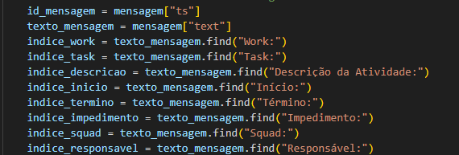
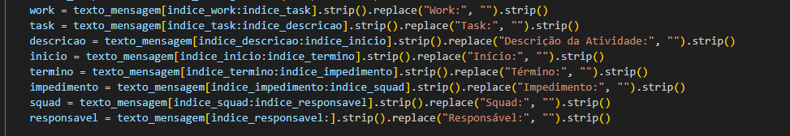
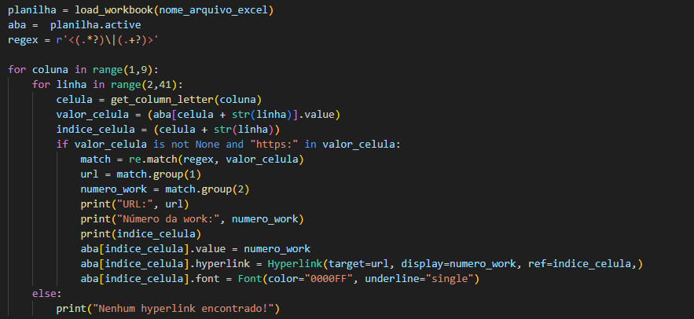

# Gerador de Relatórios Automáticos  

Após a criação do time de produtividade, nós os encarregados de gerar o plano de ação semanal, tivemos uma nova tarefa adicionada nas nossas segundas e sextas.
Como qualquer outra tarefa a criação desses relatórios demanda tempo e pode nos custar horas preciosas no fim do mês, com isso em mente, pensamos em uma forma de auxiliar a equipe em finalizar essa atividade de modo que ela se torne mais otimizada e eficiente, automatizando o processo de criação de relatórios por meio de uma aplicação em Python. 

A aplicação é simples e maleável, sendo de fácil instalação e modificação para casos específicos.

## Instalação

Após clonar esse repositório é necessário algumas configurações de setup para usar a aplicação 
- Instalar o Python
  - [Python Download](https://www.python.org/downloads/)    

- Instalar as bibliotecas utilizadas no projeto no terminal (ctrl + ') usando pip
  - slack_sdk: pip install slack_sdk
  - pandas: pip install pandas
  - openpyxl: pip install openpyxl 
 
- Pode ser necessário instalar as seguintes extensões (Caso você utilize VSCode)
  - Python
  - Pylance

 ## Como utilizar 
 
Para usar a aplicação, você deve entrar no slack de teste criado para utilizar o bot. 

O uso da aplicação é simples e intuitivo, basta você abrir o arquivo em uma IDE (Pycharm, VSCode, etc) e configurar o canal do slack que o bot vai buscar as mensagens (no meu caso teste-python-org) 

## Como modificar

O processo de modificação do código é muito simples, basta adicionar algumas linhas para atender suas necessidades  
 - Indicar o índice que começa a String que você quer extrair
Exemplo (indice_work = texto_mensagem.find("Work:")) vai encontrar onde começa "Work" na string de mensagens 
 

- Limpar a string com strip e replace indicando o índice de início e fim para pegar só o valor relevante aquela variável 

Além de mudar a formatação das mensagens, você pode fazer inúmeras coisas com esse código para atender suas necessidades, o limite é sua imaginação.

## Exemplo de modificação

Novo índice: 
indice_task = texto_mensagem.find("Task:") 
Nova variável: 
task = texto_mensagem[indice_task:indice_descricao].strip().replace("Task:", "").strip() 
Hyperlinks automáticos: 

